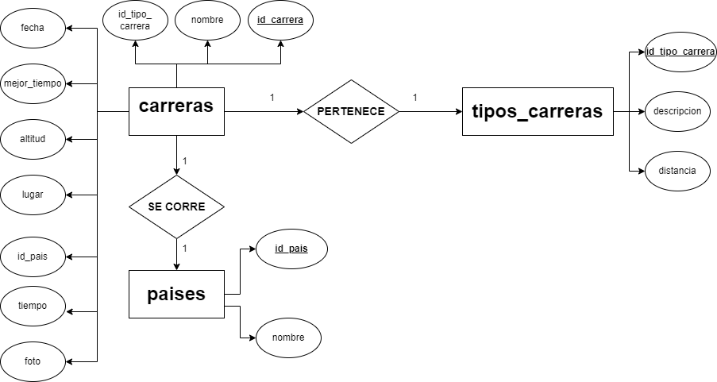

# Carreras

## Listado de Entidades

### Carreras **(ED)**
- id_carrera _INT_ **(PK)**
- nombre_carrera _VARCHAR_
- id_carrera _INT_ **(FK)**
- fecha _DATE_
- tiempo _TIME_
- mejor_tiempo _BOOLEAN_
- altitud _VARCHAR_
- id_pais _INT_ **(FK)**
- lugar  _VARCHAR_
- foto _TEXT_

#### Reglas de Negocios CRUD carrera
1. Crear el registro carrera.
1. Actualizar datos de carrera dad una condición en particular.
1. Leer el registro una carrera en particular dada una condición.
1. Leer Todos los Registros de carreras
1. Eliminar los datos de una carrera dada una condición.

### Tipos_Carreras **(EC)**
- id_tipo_carrera _INT_ **(PK)**
- descripcion _TEXT_
- distancia _VARCHAR_ **(UQ)**

#### Reglas de Negocios CRUD tipos_carreras
1. Crear el registro de tipo_carrera.
1. Actualizar datos de tipo_carrera dada una condición en particular.
1. Leer el registro un tipo_carrera en particular dada una condición.
1. Leer Todos los Registros de un tipo_carreras
1. Eliminar los datos de un tipo_carrera dada una condición.

### Paises **(EC)**
- id_pais _INT_ **(PK)**
- nombre_pais _VARCHAR_

#### Reglas de Negocios CRUD paises
1. Crear el registro de paises.
1. Actualizar datos de paises dada una condición en particular.
1. Leer el registro de un pais en particular dada una condición.
1. Leer Todos los Registros de los paises
1. Eliminar los datos de paises dada una condición.

## Relaciones
1. Una **carrera** _pertenece_ a un **tipo de carrera** (_1 a 1_)
1. Una **carrera** _se corre_ en un **pais** (_1 a 1_)

## Modelo Entidad - Relación

## Modelo Relacional de la DB

